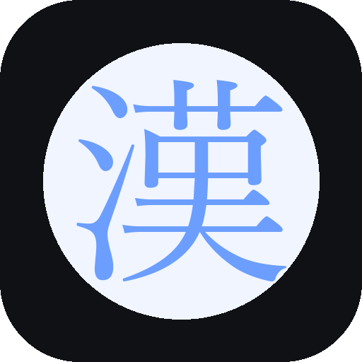

# 漢 Kanji Study

Да Я просто в метрошке удобно потыкать хотел по кандзи...
Работает офлайн, устанавливается на домашний экран, прогресс сохраняется локально в браузере.

  

## ✨ Возможности

- 📖 **2136 кандзи** уровней JLPT N5–N1 с чтениями (он/кун) и примерами слов
- 📕 **481 кандзи из Basic Kanji Book**
- 🇷🇺 **Русские значения** кандзи (перевод через Google Translate)
- 🔄 **SRS-повторение** — интервальный алгоритм, похожий на SM-2
- ✅ **Три режима тестов**: кандзи → значение, кандзи → чтение, значение → кандзи
- 🎯 **Режим «Сегодняшние кандзи»** — 10 случайных пройденных на повторение + ровно N новых
- ✍️ **Прописи пальцем** — можно тренировать написание кандзи прямо на экране - ПОКА РОБИТ СОМНИТЕЛЬНО
- 📊 **Статистика** — прогресс по уровням, streak, средний уровень владения
- 🎚️ **Фильтр по уровням JLPT** и отдельный фильтр **«По книге BKB»**
- 💾 **Экспорт/импорт прогресса** в JSON
- 📴 **Офлайн-режим** — приложение работает без интернета
- 📱 **Устанавливается на домашний экран** как нативное приложение

## 🚀 Установка

### Android (Chrome)
1. Открой [ссылку на приложение](https://avvallonia.github.io/Kanji-Study-Card-App/)
2. Через пару секунд появится баннер «Установить Kanji Study как приложение?» → **Да**
3. Если баннера нет — меню браузера → **Установить приложение**

### iOS (Safari)
1. Открой [ссылку на приложение](https://avvallonia.github.io/Kanji-Study-Card-App/)
2. Кнопка **Поделиться** (квадрат со стрелкой)
3. **На экран «Домой»** → **Добавить**
4. Запускай с иконки — откроется без адресной строки

### Desktop (Chrome/Edge)
1. Открой сайт
2. Иконка **установки** в адресной строке (⊕ или 📥)
3. Или: меню → **Установить Kanji Study**

## 📖 Как пользоваться

### Главный экран
- **🔥 Streak** — сколько дней подряд занимаешься
- **Календарь** — 35 последних дней. Красный кружок = занимался в этот день
- **Полоса 📖 BKB** — прогресс по книге Basic Kanji Book
- **Полосы N5–N1** — прогресс по уровням JLPT
- **Кнопка «Сегодняшние кандзи»** — основной ежедневный флоу
- **Счётчики сегодня** — сколько повторил / изучил новых

### Ежедневный флоу

**Первый заход в день:**
1. Нажми **«Сегодняшние кандзи»**
2. Проходишь тест по **10 случайным пройденным кандзи** (смешанные типы вопросов)
3. После теста переходишь к **изучению новых кандзи** — ровно столько, сколько задано в настройках (`Новых в день`)
4. После изучения — **тест по новым** кандзи

**Повторное нажатие в тот же день:**
- Кнопка становится **тусклой** с подписью «Сегодня нет новых кандзи»
- Если нажать — появится модалка **«Вы уже сегодня изучили новые кандзи. Хотите ещё?»**
- **Да** → ещё одна пачка новых (без повторений)
- **Нет** → ничего не происходит

### SRS — как работает повторение
Каждой карточке присваивается интервал до следующего показа:
- Изучил впервые → +1 день
- Ответил правильно в тесте → интервал растёт по коэффициенту ease
- Ошибся → интервал сбрасывается, карточка вернётся быстрее
- Ease (коэффициент сложности) подстраивается индивидуально

### Фильтр уровней
- Тап по **☰** в левом верхнем углу — выдвигается меню
- **Все уровни** — все 2136 кандзи
- **📖 По книге BKB** — только кандзи из Basic Kanji Book (~481)
- **N5 / N4 / N3 / N2 / N1** — по уровням JLPT

### Статистика
- Прогресс по каждому уровню отдельно
- Средний уровень владения (mastery) изученных кандзи
- Streak (🔥) — сколько дней подряд занимался
- Настройка **«Новых в день»** — количество новых кандзи за один заход

### Бэкап
- **Статистика → Данные → Экспорт** — сохраняет JSON с прогрессом
- **Импорт** — восстанавливает из файла

## 🛠️ Разработка
ПОКА ЖОСКА ДУМ
## 📚 Источники данных

Проект использует четыре независимых источника. Для каждого кандзи или слова
приоритет отдаётся самому качественному источнику по цепочке:

| Приоритет | Источник | Что даёт | Формат |
|---|---|---|---|
| 1 | Basic Kanji Book (Vol. 1+2) | Значения, чтения, примеры слов | Ручная оцифровка |
| 2 | KanjiStudy_jpn-rus | Русские значения кандзи | Готовый список |
| 3 | AnchorI + davidluzgouveia | Кандзи, уровни JLPT, чтения | JSON |
| 4 | Warodai | Русские переводы слов из примеров | EDICT2 |
| 5 | Google Translate | Перевод английских значений кандзи | API |

### 🔹 Кандзи, уровни JLPT и чтения

- **Репозиторий:** [AnchorI/jlpt-kanji-dictionary](https://github.com/AnchorI/jlpt-kanji-dictionary)
- **Что даёт:** список из 2136 кандзи с уровнями JLPT (N5–N1), описаниями и структурой
- **Лицензия:** открытая, свободное использование

- **Репозиторий:** [davidluzgouveia/kanji-data](https://github.com/davidluzgouveia/kanji-data)
- **Что даёт:** корректные онные и кунные чтения, английские значения, количество черт, частота употребления
- **Лицензия:** MIT

### 🔹 Русские значения кандзи

- **Репозиторий:** [nakopylov/KanjiStudy_jpn-rus](https://github.com/nakopylov/KanjiStudy_jpn-rus)
- **Что даёт:** значения базовых кандзи на русском языке (~924 записи)
- **Лицензия:** **GNU AGPL-3.0** — при использовании в коммерческих целях необходимо раскрыть исходный код проекта и сохранить эту лицензию

### 🔹 Русские переводы слов

- **Сайт:** [Warodai](http://www.warodai.ru) — японско-русский словарь на основе Большого японско-русского словаря (БЯРС)
- **Что даёт:** переводы слов в примерах использования кандзи (~6800 записей после фильтрации)
- **Лицензия:** **CC BY-NC-ND 3.0** (Атрибуция — Некоммерческое использование — Без производных)

### 🔹 Basic Kanji Book Vol. 1 & 2

- **Издательство:** Bonjinsha Co., Ltd.
- **Что даёт:** ~481 кандзи с качественными примерами в книжном формате `日本(に・ほん／にっ・ぽん) Япония` и русскими переводами для Vol. 1
- **Как получено:** оцифровано вручную из личной копии книги
- **Использование:** только для личного обучения. Коммерческое использование книги или её фрагментов запрещено правообладателем.

### 🔹 Перевод английских значений

- **Сервис:** Google Translate (публичный endpoint `translate.googleapis.com` или MyMemory API)
- **Что даёт:** русский перевод английских значений кандзи, отсутствующих в BKB
- **Использование:** скрипт `translate_kanji.py` переводит 1067 кандзи

---

## ⚖️ Лицензии

### Код приложения

**MIT License** — свободно используйте, модифицируйте, распространяйте,
включайте в свои проекты без ограничений.

### Данные из сторонних источников

#### Warodai — CC BY-NC-ND 3.0

Словарь Warodai распространяется под лицензией
**[Creative Commons Attribution-NonCommercial-NoDerivatives 3.0](https://creativecommons.org/licenses/by-nc-nd/3.0/)**:

- ✅ **Разрешено:**
  - Использовать в личных и некоммерческих целях
  - Указывать авторство
- ❌ **Запрещено:**
  - Коммерческое использование
  - Распространение изменённых версий словаря как самостоятельного продукта

#### KanjiStudy_jpn-rus — AGPL-3.0

Русские значения кандзи из проекта [nakopylov/KanjiStudy_jpn-rus](https://github.com/nakopylov/KanjiStudy_jpn-rus)
распространяются под лицензией **GNU AGPL-3.0**:

- ✅ **Разрешено:**
  - Использовать в любых проектах (включая коммерческие)
  - Модифицировать и распространять
- ⚠️ **Обязательно:**
  - Открывать исходный код проекта, если вы его модифицировали
  - Сохранять ту же лицензию (AGPL-3.0) для производных

Если вы хотите использовать приложение в коммерческих целях, вам необходимо
исключить `kanji_ru.js` или получить разрешение авторов словаря.

#### Basic Kanji Book — все права защищены

Данные из книги **Basic Kanji Book Vol. 1 & 2** (Bonjinsha Co., Ltd.) защищены авторским правом.

- Приложение — **некоммерческий учебный проект**
- Данные оцифрованы вручную для **личного обучения**
- Коммерческое использование книги или её фрагментов **запрещено правообладателем**
- Если вы хотите использовать приложение в коммерческих целях, вам необходимо исключить `bkb_data.js` или получить разрешение издателя

#### AnchorI и davidluzgouveia — открытые данные

- **AnchorI/jlpt-kanji-dictionary** — открытая лицензия, свободное использование
- **davidluzgouveia/kanji-data** — MIT License

#### Google Translate

Переводы английских значений на русский получены через публичный endpoint
Google Translate. Результаты перевода **не являются собственностью Google** —
это машинный перевод исходных данных из открытых источников. Используйте
свободно, но помните, что машинный перевод может содержать ошибки.

---

## 🙏 Благодарности

Проект был бы невозможен без труда авторов и мейнтейнеров следующих проектов:

### Данные и датасеты

- **[AnchorI](https://github.com/AnchorI)** — датасет JLPT кандзи с уровнями и описаниями
- **[davidluzgouveia](https://github.com/davidluzgouveia)** — kanji-data с корректными чтениями
- **[nakopylov](https://github.com/nakopylov)** — проект KanjiStudy_jpn-rus с русскими значениями кандзи
- **Авторам [Warodai](http://www.warodai.ru)** — за огромный труд по созданию японско-русского словаря
- **Bonjinsha Co., Ltd.** — за издание Basic Kanji Book, ставшей основой для учебного материала

### Технологии и инфраструктура

- **[KanjiVG](https://kanjivg.tagaini.net/)** — датасет SVG-описаний порядка черт кандзи (вдохновение для будущих функций)
- **[Google Translate](https://translate.google.com)** — за машинный перевод значений
- **[GitHub Pages](https://pages.github.com)** — за бесплатный хостинг PWA

### Обратная связь и тестирование

- **[Твоё имя]** — за тестирование приложения, дизайн-предложения, вёрстку и оцифровку BKB

### Сообщество

Отдельное спасибо всем, кто присылает правки, сообщает об ошибках
и предлагает улучшения. Если вы нашли опечатку или неточный перевод — откройте
issue или пришлите PR, я буду рад.

---

## 💡 Как можно помочь проекту

1. **Найти ошибки** в переводах или чтениях — откройте issue
2. **Добавить кандзи** в `bkb_data.js` — пришлите PR с недостающими кандзи
3. **Улучшить переводы** — если видите неточность от Google Translate, пришлите исправление
4. **Перевести BKB Vol. 2** на русский язык вручную (сейчас там английские значения)
5. **Расширить функциональность** — озвучка, порядок черт, Anki-экспорт, синхронизация

## 📄 Полный текст лицензий

- [MIT License](https://opensource.org/licenses/MIT) — для кода
- [CC BY-NC-ND 3.0](https://creativecommons.org/licenses/by-nc-nd/3.0/) — для Warodai
- [GNU AGPL-3.0](https://www.gnu.org/licenses/agpl-3.0.html) — для KanjiStudy_jpn-rus
